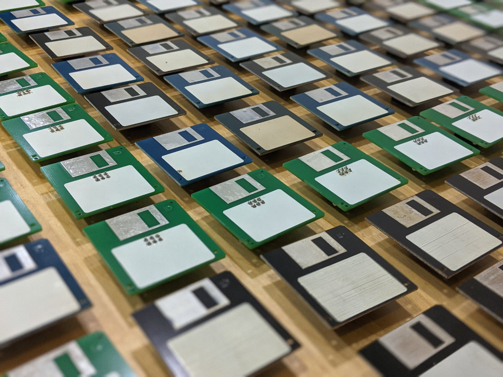
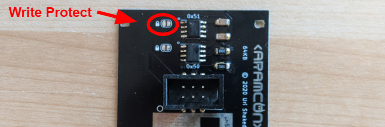
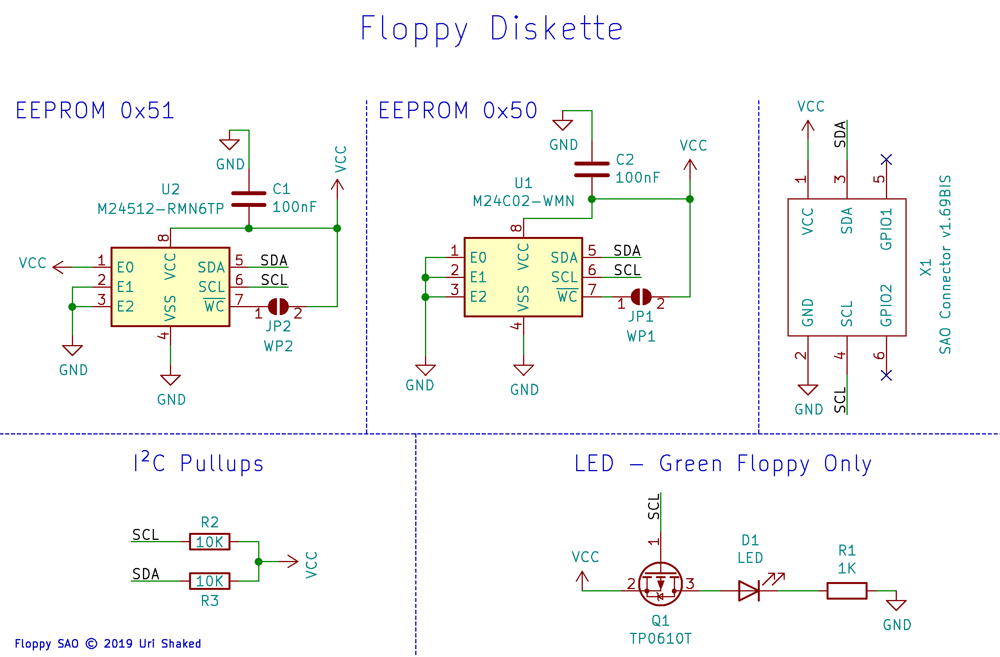

# The Floppy

> Shitty Add-on to Copy Apps, Data, and Malware between Smart Cconference Badges

Each floppy contains 64kb of EEPROM storage, accessible over the SAO I2C bus. In addition, there is an auxilary 256-byte EEPROM that can be used to store the [Badge Add-on ID](https://github.com/urish/badge-addon-id) data.

## Floppy Flavors

The floppy comes in three flavors:

- Through-hole - Uses a through hole SAO IDC connector. Includes a LED that indicates I2C bus activity.
- SMD - Uses a surface mount SAO IDC connector, keeping the front side of the floppy clean from pin holes.
- Full Size - A full size (3.5") flavor of the Through-hole floppy SAO.

## Write protect

You can write protect The Floppy by soldering the two write-protect bridges on the board:

## Floppy SAO Storage

The main EEPROM is available at address 0x51, and includes 64KB of storage. When formatting your floppies with the FAT file system, you'll have about 47kb (48128 bytes) available for your files.

## Floppy SAO metadata

The floppy contains an auxiliary EEPROM with 256 bytes of storage. This EEPROM holds information about the capacity and the format of the main EEPROM. We recommend using the [Binary Badge Add-on ID](https://github.com/urish/badge-addon-id) format for storing this information, along with the following 4-byte payload:

| Byte | Description                                               |
| ---- | --------------------------------------------------------- |
| 0    | File system format: 0 for FAT, 1 for TAR, 2 for ZIP       |
| 1    | Data EEPROM address, should be 0x51                       |
| 2    | EEPROM byte size exponent (e.g. 16 for 64 KB EEPROM)      |
| 3    | EEPROM page size exponent (e.g. 7 for 128 bytes per page) |

## Schematic diagram

The "LED - Green Floppy Only" section only applies to the Through-hole and Full Size flavors of The Floppy.

### BOM

| Designators | Part                                           | QTY | Flavor       | Comment                                 |
| ----------- | ---------------------------------------------- | --- | ------------ | --------------------------------------- |
| U1          | M24C02-WMN                                     | 1   | All          | 256 byte EEPROM, I2C address 0x50       |
| U2          | M24512-RMN6TP                                  | 1   | All          | 64 KB EEPROM, I2C address 0x51          |
| C1, C2      | 1206 100nF Multilayer Ceramic Capacitor (MLCC) | 2   | All          |
| R2, R3      | 1206 10kΩ Resistor                             | 2   | All          | I2C bus pull-ups                        |
| X1          | 2.54mm pitch 6-pin IDC male connector          | 1   | All          | Use an SMD connector for the SMD flavor |
| D1          | 0805 LED (Red)                                 | 1   | Through-hole | I2C bus activity LED                    |
| Q1          | SOT-23-3 P-Channel MOSFET (e.g. LBSS84LT1G)    | 1   | Through-hole |
| R1          | 1206 1kΩ Resistor                              | 1   | Through-hole |

## License

Copyright (C) 2020, Uri Shaked. Released under the MIT License.
